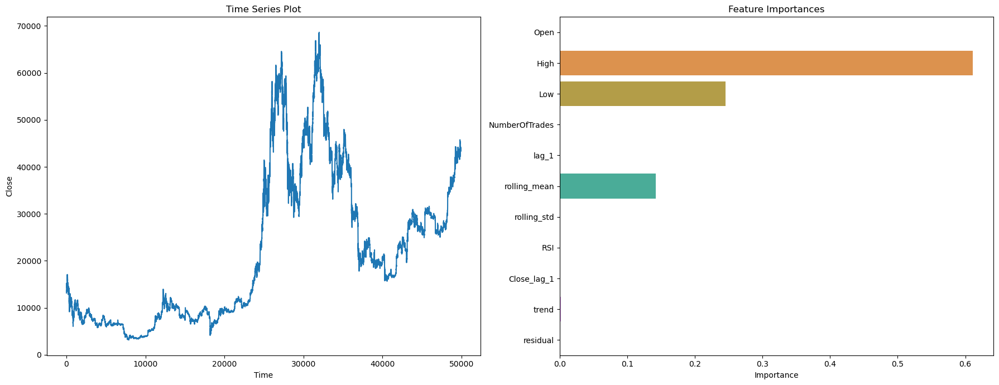

# 🌟 Alpha Feature Selector for Time Series 🕒

Welcome to `alpha_Feat_Selector` – your go-to function for time series feature selection in Machine Learning! 🚀


## 📖 Introduction

Diving into time series data? Struggling with feature selection? Say no more! `alpha_Feat_Selector` is here to revolutionize your ML workflow. Designed specifically for time series data, it's both powerful and user-friendly. 🌐

## ✨ Features

- **Tailored for Time Series**: Specialized in handling time-bound data with finesse.
- **Insightful Visualizations**: Includes time series plots and feature importance charts.
- **Easy to Use**: Perfect for both ML wizards and apprentices!
- **Efficient and Robust**: Optimized for performance, ready for large datasets.

## 🚀 Quick Start

```python

from alpha_feat_selector import alpha_Feat_Selector

# Load your DataFrame
# df = ...

# Unleash the magic!
df_clean = alpha_Feat_Selector(df, 'cleaned_data.csv', 'Close')

```

📊 Visualization Dashboard

Behold the power of visual insights:




📚 Installation


```python

pip install pandas numpy matplotlib seaborn sklearn statsmodels tqdm

```

🤖 How to Use

Just a few steps and you're set to go! Check out our detailed usage guide in all notebooks.

👐 Contributing

Join the adventure! Contributions, issues, and feature requests are all welcome. Let's make alpha_Feat_Selector even more awesome! 🌟
📜 License

Distributed under the MIT License. See LICENSE for more information.
📞 Contact

Project Link: [https://github.com/your_username/alpha_Feat_Selector](https://github.com/AIFlowML/Time_Series_Tools)

🙌 Acknowledgements

Shoutout to the Python community!
Special thanks to contributors and users like you.

Give a ⭐️ if this project helped you! Spread the word! 📢
